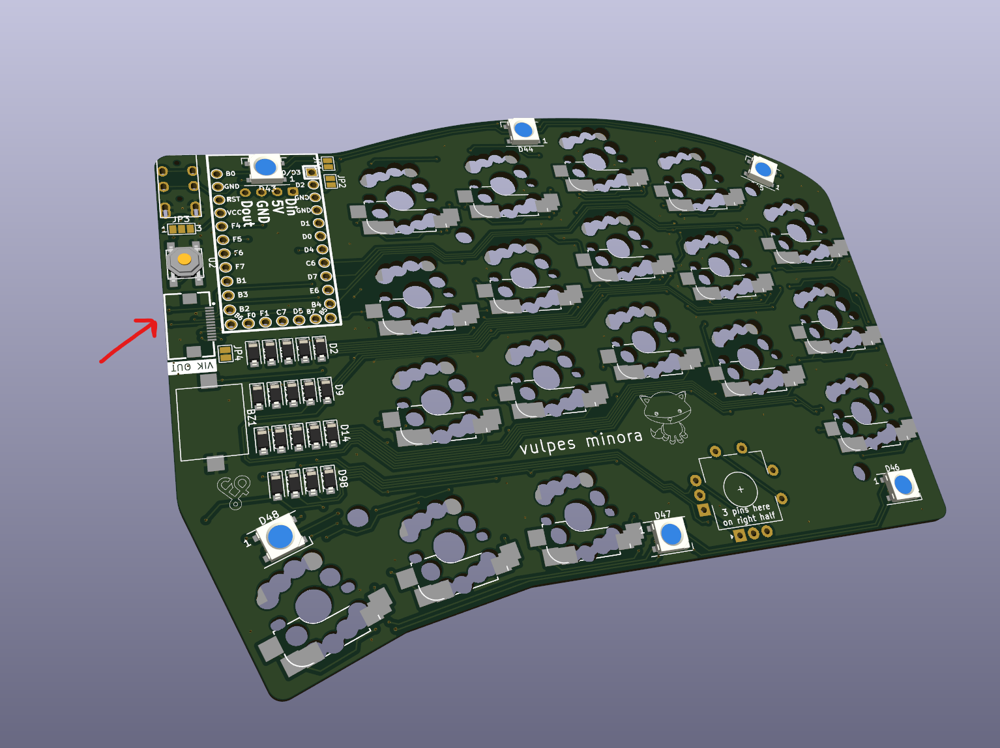
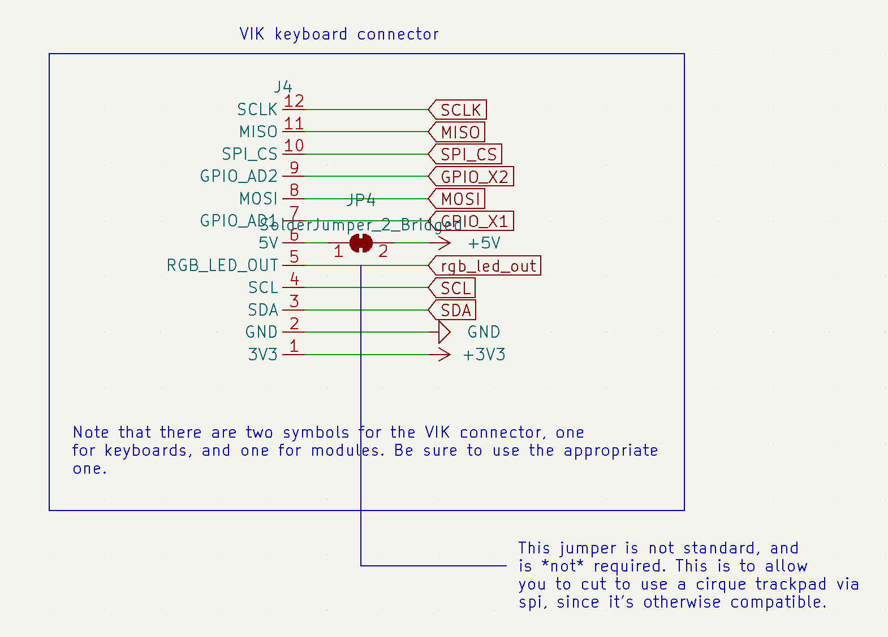
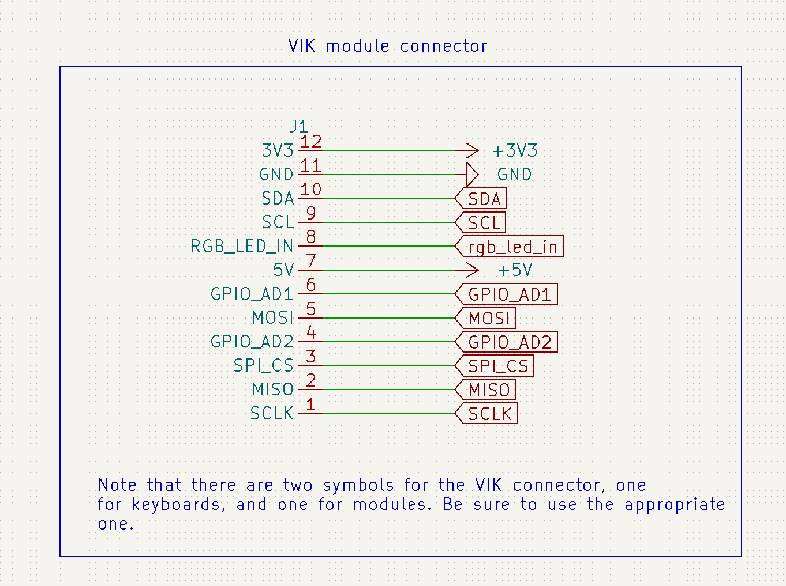
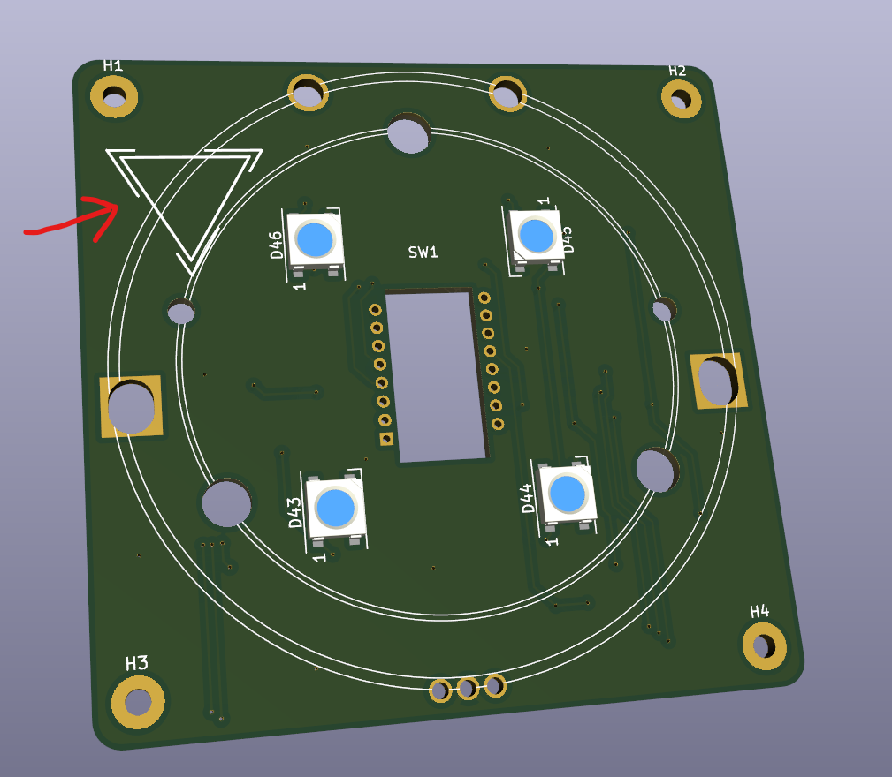

# VIK

**IMPORTANT: This is still undergoing testing. Until this comment is removed, I don't recommend using anything in the repo without consulting me**

## Overview

VIK is a standard for a data interface between printed circuit boards. It is intended to provide modularity between a mechanical keyboard pcb and additional features. The main pcb can have a controller and a switch matrix, while the modules can provide additional features.

The standard specifies only a couple of things:
1. The type of connector
2. The signals mapped to each pin on the connector
3. The type of cable
4. Inclusion of the VIK logo on the PCB

## Renders

Keyboard with VIK certification using the keyboard footprint

Module with VIK certification using the module footprint

### What value does this bring?

#### Consoldiates efforts for feature design

In a community full of talented people doing lots of innovation, we are seeing a plethora of new options for keyboard layout configurations, features, etc. With all this innovation, we're doing very little to share our efforts.

For example, if one person invests in adding support for a trackball with a scroll wheel, others have to identify how to do that, and add support for their keyboard design.

#### Ease of upgrades

With VIK support, upgrading your features is as simple as getting a new VIK module, and swapping it out.

Let's say you built a keyboard with an integrated trackpad, and you love it. Months after setting it up, you realize that you'd love to have a trackball and haptic feedback. Now you need to design a new pcb (or find someone who has) with the features you'd like. Most people don't know how, or don't want to put forth this effort, so they will settle for their current configuration. With much less effort, you can create a new VIK module, assemble it, and connect to your existing keyboard.

#### One feature for many keyboard layouts

One of the biggest challengs I find, is that a keyboard may have some really excellent features, but I really don't like the key layout. In that case, I won't be interested in the keyboard, despite wanting the features.

Provided that keyboard designers adopt the VIK standard on the main keyboard pcb, the modules are usable on any of those keyboards. So, you can design or find a keyboard that has your preferred layout, and then add the features that you like. True customizability for the exact keyboard you want to use.

## Specifications

There are two things that must be implemented for this to be successful. The keyboard pcb must support the VIK interface, and the module pcb must support the VIK interface

### Connector

The required connector is a FPC 12 pin 0.5mm pitch connector. It should be available on both the keyboard pcb and the module pcb.

### Cable

The cable should be a 12 pin 0.5mm pitch FPC Type A cable (leads are exposed on the same side).

The specs below state that you must invert the connector pin order between the keyboard and the module, which means Type A is required.

### Interface

The interface includes the following signals:
* 3.3V
* GND
* SDA
* SCL
* RGB Data Out
* 5V
* GND
* MOSI
* Digital/Analog GPIO
* SPI CS
* MISO
* SCLK

The order specified above is the order they should be used on the FPC connector on the **keyboard side**, pins 1 through 12. For the module pcbs, they should be inverted, since the cable will automatically invert the order when connected. If you use the VIK Kicad symbols and footprints, this is managed for you. See the [Implementation with Kicad](#implementation-with-Kicad) section below

Here is an example schematic for the keyboard FPC connector:

Here is an example schematic for the module FPC connector:

### VIK logo

So long as you adhere to the specs above, you can consider your keyboard pcb or module VIK enabled. The last thing you do before publishing or manufacturing your PCB is to include the VIK logo.

There are a collection of logos you can use in the kicad/vik.pretty directory of this repository, all prefixed with `vik-logo`. For instance, you could take the pre-made kicad footprints and include them on your pcb. If you aren't using kicad, there is a dxf and svg you can use as well.

## Implementation with Kicad

Given Kicad's popularity, I've made it (hopefully) very convenient to implement VIK on the keyboard and module side.

### Add symbols and footprints to your Kicad project

1. Clone this repository to your local machine
2. Add the VIK symbol library your project
3. Add the VIK footprint library to your project

Please note that the path in the screenshots won't be the same as yours. It should be:  
`{PATH TO CLONE OF THIS REPO}/kicad/vik.kicad_sym`  
and  
`{PATH TO CLONE OF THIS REPO}/kicad/vik.pretty`  

### Kicad keyboard connector

1. Add a new symbol in the schematic, and select the `vik-keyboard-connector`
2. Connect all the signals as specified
3. Associate with the type of footprint you'd like to use (all of the VIK examples use the horizontal connector footprint). Given you are making a keyboard connector, be sure to use the ones that have the word keyboard in them. See the image below for an example.
4. Update your PCB from the schematic and wire it up!

### Kicad module connector

1. Add a new symbol in the schematic, and select the `vik-keyboard-module`
2. Connect all the signals as specified
3. Associate with the type of footprint you'd like to use (all of the VIK examples use the horizontal connector footprint). Given you are making a module connector, be sure to use the ones that have the word module in them. See the image below for an example.
4. Update your PCB from the schematic and wire it up!

## Design guidelines and recommendations

### Reference designs

For the keyboard side, I created a keyboard called [vulpes minora](http://github.com/sadekbaroudi/vulpes-minora). This keyboard has been manufactured and tested to work with VIK modules.

For the module side, please see the pcb directory in this repository. Each subdirectory within it has a module that you can review to see how these are implemented.

### I2C guidelines

#### Keyboard pcb

As mentioned above, the responsibility of using pull up resistors is on the VIK modules. This may cause challenges for a few reasons. You may want (or need) to use I2C on the main keyboard PCB, which means you need to use pull up resistors. If this is the case, please provide instructions to inform the users that when using VIK modules, they will need to remove the pull up resistors.

#### Module pcb

When designing a module, please ensure that you include pull up resistors, since the guidelines state that the keyboard pcb is not responsible for it.

It may be tempting to use the I2C gpio for purposes other than I2C. For example, in the pers60 scroll wheel modules included in this repository, SDA and SCL are used for the scroll wheel encoder. If you decide to do this, the [VIK certification](#VIK-certification) card will be flagged as a failure. While this is acceptable, it means that your module will not work with a fair number of keyboards, since many use I2C.

### Microcontroller selection

If you are designing a keyboard pcb that uses a dev board as a controller (e.g. pro micro, elite-c, stemcell, etc), you should consider that the VIK specs calls for 3.3V and 5V. Given these controllers operate on 5V and don't provide 3.3V, you won't be able to use them for VIK compatibility without additonal circuitry to convert 5V to 3.3V.

Some options include:
1. Support only RP2040 based controllers (e.g. splinky, elite-pi, helios), where VCC is 3.3V, and the RAW pin provides 5V
2. Support other 5V controllers, and use something like an LDO to convert 5V to 3.3V for the VIK 3.3V signal
3. Anything you want, as long as you can provide 5V and 3.3V

The vulpes minora is an example of point number 1 above.

## VIK certification

In order to be VIK certified, you should be compliant with everything above, and have your keyboard or module reviewed. Upon review, the reviewer will make a card for your pcb, as explained below.

### VIK keyboard certification card

#### Descriptions

* **FPC connector:** has the correct FPC connector with the right pinout, and is wired to specificaton. See the connectors in the kicad/vik.pretty directory
* **Breakout pins:** includes breakout pins using the [VIK breakout pin footprint](https://github.com/sadekbaroudi/vik/blob/master/kicad/vik.pretty/vik-keyboard-throughole.kicad_mod), or has through holes for all the signals. This allows easy access to all the signals. Also, the footprint is compatible with a [hand solderable FPC breakout board](https://www.amazon.com/uxcell-Converter-Couple-Extend-Adapter/dp/B07RVD1J1K).
* **Supplies: SPI** supplies SPI
* **Supplies: I2C:** supplies I2C
* **I2C on main PCB:** Does the main PCB use any I2C already. If this is true, the next field must have a value
* **I2C pull ups:** I2C pull up resistor value, :x: if no pull ups on the main pcb, or resistor value if present
* **Supplies: RGB:** supplies RGB data out
* **Supplies: Extra GPIO:** uses the extra GPIO, response will be one of: (**No | Digital Only | Analog/Digital**)

#### Keyboard sample cards

General example:

| Category                 | Classification          | Response           |
| -----------------------  | ----------------------- | ------------------ |
| FPC connector            | Required                | :heavy_check_mark: |
| Breakout pins            | Recommended             | :x:                |
| Supplies: SPI            | Strongly recommended    | :heavy_check_mark: |
| Supplies: I2C            | Strongly recommended    | :heavy_check_mark: |
| I2C on main PCB          | Discouraged             | :heavy_check_mark: |
| I2C pull ups             | Informative             | 2.2kΩ              |
| Supplies: RGB            | Strongly recommended    | :x:                |
| Supplies: Extra GPIO     | Strongly recommended    | No                 |

A "perfect" keyboard card would look like this:

| Category                 | Classification          | Response           |
| -----------------------  | ----------------------- | ------------------ |
| FPC connector            | Required                | :heavy_check_mark: |
| Breakout pins            | Recommended             | :heavy_check_mark: |
| Supplies: SPI            | Strongly recommended    | :heavy_check_mark: |
| Supplies: I2C            | Strongly recommended    | :heavy_check_mark: |
| I2C on main PCB          | Discouraged             | :x:                |
| I2C pull ups             | Informative             | N/A                |
| Supplies: RGB            | Strongly recommended    | :heavy_check_mark: |
| Supplies: Extra GPIO     | Strongly recommended    | :heavy_check_mark: |

### VIK module certification card

#### Descriptions

* **FPC connector:** has the correct FPC connector with the right pinout, and is wired to specificaton. See the connectors in the kicad/vik.pretty directory
* **Breakout pins:** includes breakout pins using the [VIK breakout pin footprint](https://github.com/sadekbaroudi/vik/blob/master/kicad/vik.pretty/vik-keyboard-throughole.kicad_mod), or has through holes for all the signals. This allows easy access to all the signals. Also, the footprint is compatible with a [hand solderable FPC breakout board](https://www.amazon.com/uxcell-Converter-Couple-Extend-Adapter/dp/B07RVD1J1K).
* **Uses: SPI:** the module is utilizing SPI
* **SPI used for SPI only:** if you are using any of the SPI gpio for any purpose other than SPI, this will remain unchecked. This means that keyboard pcbs that use SPI will be incompatible with this module.
* **Uses: I2C:**
* **I2C used for I2C only:** if you are using any of the I2C gpio for any purpose other than I2C, this will remain unchecked. This means that keyboard pcbs that use I2C will be incompatible with this module.
* **I2C pull ups:** I2C pull up resistor value
* **Uses: RGB:** uses RGB data out
* **Uses: Extra GPIO:** uses the extra GPIO, response will be one of: (**No | Analog | Digital**), along with what it's used for.

#### Module sample card

General example:

| Category                | Classification          | Response           |
| ----------------------- | ----------------------- | ------------------ |
| FPC connector           | Required                | :heavy_check_mark: |
| Breakout pins           | Recommended             | :x:                |
| Uses: SPI               | Optional                | :heavy_check_mark: |
| SPI used for SPI only   | Strongly recommended    | :heavy_check_mark: |
| Uses: I2C               | Optional                | :heavy_check_mark: |
| I2C used for I2C only   | Strongly Recommended    | :heavy_check_mark: |
| I2C pull ups            | Required                | 4.7kΩ              |
| Uses: RGB               | Optional                | :x:                |
| Uses: Extra GPIO        | Optional                | No                 |

## Known list of VIK certifications

### Keyboards

* [vulpes minora](http://github.com/sadekbaroudi/vulpes-minora)

### Modules

* [haptic](https://github.com/sadekbaroudi/vik/tree/master/pcb/haptic)
* [pers60-cirque-leds](https://github.com/sadekbaroudi/vik/tree/master/pcb/pers60-cirque-leds)
* [pers60-pmw3360-leds](https://github.com/sadekbaroudi/vik/tree/master/pcb/pers60-pmw3360-leds)
* [pmw3360](https://github.com/sadekbaroudi/vik/tree/master/pcb/pmw3360)