# VIK

> **Warning**  
> This is a work in progress. It has been tested to be functional, but please consult **sadekbaroudi** in the **#vik** channel of the [fingerpunch discord server](https://fingerpunch.xyz/discord) if you'd like to design a keyboard or module.

> **Note**  
> **To see the list of known supported keyboards and modules, go to [this section](#known-list-of-vik-certifications) at the bottom of the readme**

> **Note**  
> Please be aware that for keyboard pcbs, VIK assumes that it's running at 3.3v logic levels. This is easily achieved by using a RP2040. If you are using a 5v controller, it is the keyboard's responsibility to level shift before going to the VIK module. See the [Microcontroller selection](#microcontroller-selection) section below

## Overview

VIK is a standard for a data interface between printed circuit boards. It is intended to provide modularity between a mechanical keyboard pcb and additional features. The main pcb can have a controller and a switch matrix, while the modules can provide additional features.

The standard specifies only a couple of things:
1. The type of connector
2. The signals mapped to each pin on the connector
3. The type of cable
4. Inclusion of the VIK logo on the PCB

> **Note**  
> Adding support for VIK is as simple as adding a symbol and footprint, provided in this repository, followed by some basic wiring. If you want to jump straight to the guide to do this using Kicad, go to [Implementation with Kicad](#implementation-with-kicad) 

## Renders

Keyboard with VIK certification using the keyboard footprint

Module with VIK certification using the module footprint

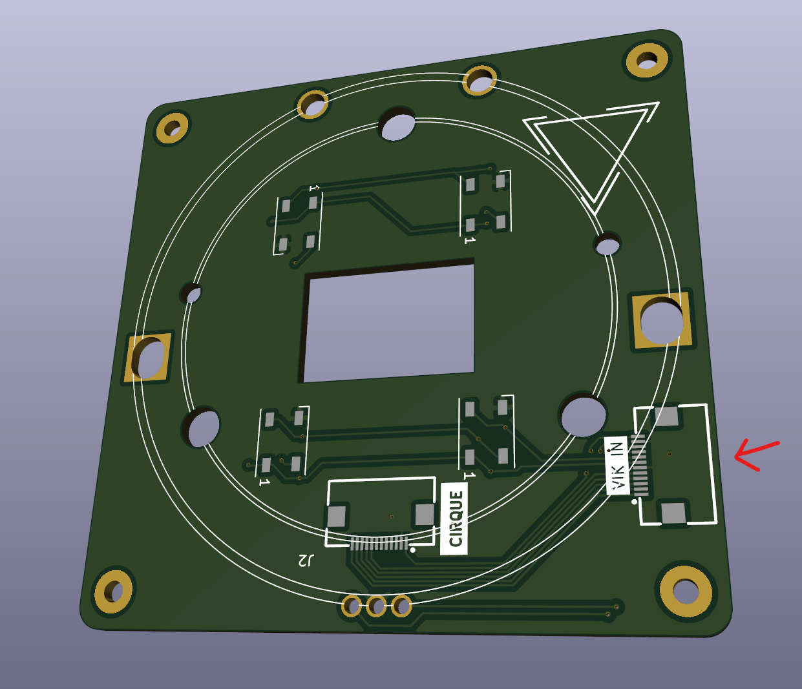

### What value does this bring?

#### Consoldiates efforts for feature design

In a community full of talented people doing lots of innovation, we are seeing a plethora of new options for keyboard layout configurations, features, etc. With all this innovation, we're doing very little to share our efforts.

For example, if one person invests in adding support for a trackball with a scroll wheel, others have to identify how to do that, and add support for their keyboard design.

#### Ease of upgrades

With VIK support, upgrading your features is as simple as getting a new VIK module, and swapping it out.

Let's say you built a keyboard with an integrated trackpad, and you love it. Months after setting it up, you realize that you'd love to have a trackball and haptic feedback. Now you need to design a new pcb (or find someone who has) with the features you'd like. Most people don't know how, or don't want to put forth this effort, so they will settle for their current configuration. With much less effort, you can create a new VIK module, assemble it, and connect to your existing keyboard.

#### One feature for many keyboard layouts

One of the biggest challengs I find, is that a keyboard may have some really excellent features, but I really don't like the key layout. In that case, I won't be interested in the keyboard, despite wanting the features.

Provided that keyboard designers adopt the VIK standard on the main keyboard pcb, the modules are usable on any of those keyboards. So, you can design or find a keyboard that has your preferred layout, and then add the features that you like. True customizability for the exact keyboard you want to use.

## Specifications

There are two things that must be implemented for this to be successful. The keyboard pcb must support the VIK interface, and the module pcb must support the VIK interface

### Connector

The required connector is a FPC 12 pin 0.5mm pitch connector. It should be available on both the keyboard pcb and the module pcb.

### Cable

The cable should be a 12 pin 0.5mm pitch FPC Type A cable (leads are exposed on the same side).

The specs below state that you must invert the connector pin order between the keyboard and the module, which means Type A is required.

### Interface

The interface includes the following signals:
* 3.3V
* GND
* SDA
* SCL
* RGB Data Out
* 5V
* Digital/Analog GPIO 1
* MOSI
* Digital/Analog GPIO 2
* SPI CS
* MISO
* SCLK

The order specified above is the order they should be used on the FPC connector on the **keyboard side**, pins 1 through 12. For the module pcbs, they should be inverted, since the cable will automatically invert the order when connected. If you use the VIK Kicad symbols and footprints, this is managed for you. See the [Implementation with Kicad](#implementation-with-Kicad) section below

### VIK logo

So long as you adhere to the specs above, you can consider your keyboard pcb or module VIK enabled. The last thing you do before publishing or manufacturing your PCB is to include the VIK logo.

There are a collection of logos you can use in the kicad/vik.pretty directory of this repository, all prefixed with `vik-logo`. For instance, you could take the pre-made kicad footprints and include them on your pcb. If you aren't using kicad, there is a dxf and svg you can use as well.

## Module PCB shape and mounting

This is optional, but highly recommended. By adhereing to a standard size and mounting, this will allow others to design keyboard pcbs and/or cases that will support mounting a variety of modules.

There are two specs, a small and large pcb.

**All mounting holes should fit M2 screws**

### Small PCB

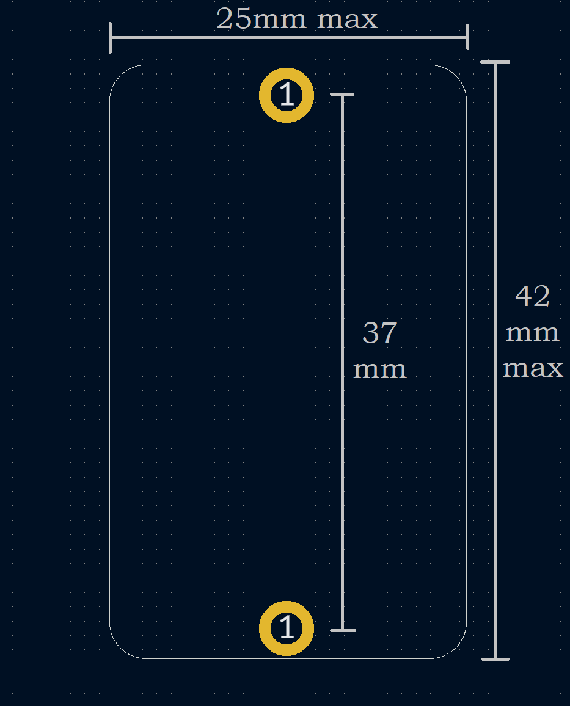

Size: less than 25mm by 42mm

Mounting: 2 mounting holes

The center of the mounting holes should be 2.1mm from the long edge (42mm), and in the center of the short edge (12.5mm assuming the width is 25mm)

### Large PCB

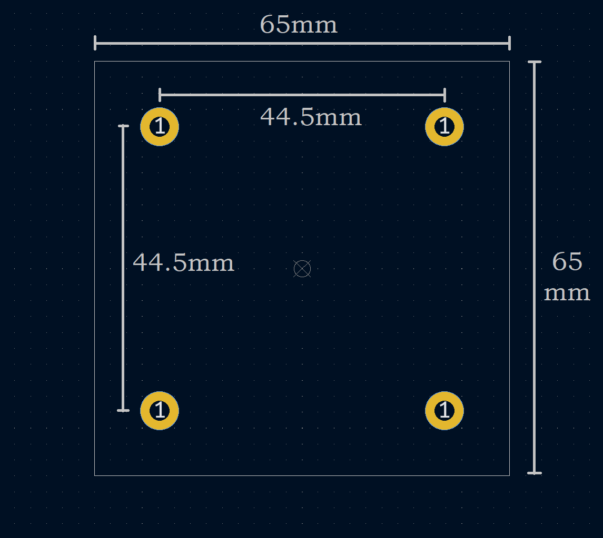

Size: less than 65mm by 65mm

Mounting: 4 mounting holes

The mounting holes should 44.5mm apart in a square, centered around the center of the pcb. Alternatively, you can place these mounting holes evenly distributed around a 63mm circle, also centered around the center of the pcb.

## Implementation with Kicad

Given Kicad's popularity, I've made it (hopefully) very convenient to implement VIK on the keyboard and module side.

### Add symbols and footprints to your Kicad project

1. Clone this repository to your local machine
2. Add the VIK symbol library your project
3. Add the VIK footprint library to your project

Please note that the path in the screenshots won't be the same as yours. It should be:  
`{PATH TO CLONE OF THIS REPO}/kicad/vik.kicad_sym`  
and  
`{PATH TO CLONE OF THIS REPO}/kicad/vik.pretty`  

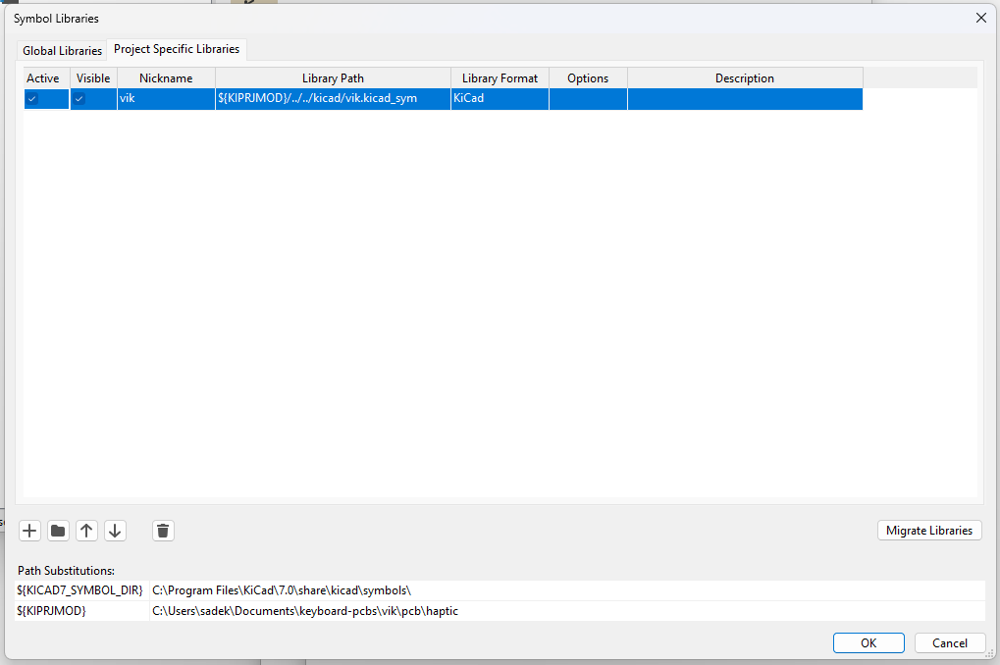

### Kicad keyboard connector

1. Add a new symbol in the schematic, and select the `vik-keyboard-connector`
2. Connect all the signals as specified
3. Associate with the type of footprint you'd like to use (all of the VIK examples use the horizontal connector footprint). Given you are making a keyboard connector, be sure to use the ones that have the word keyboard in them. See the image below for an example.
4. Update your PCB from the schematic and wire it up!

#### Adding the keyboard connector symbol

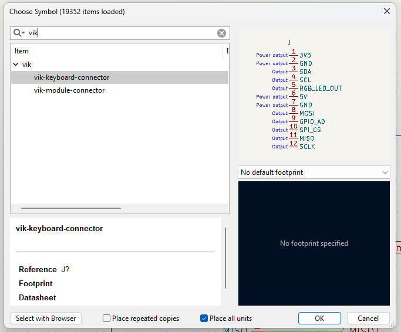

#### Assigning the keyboard connector footprint

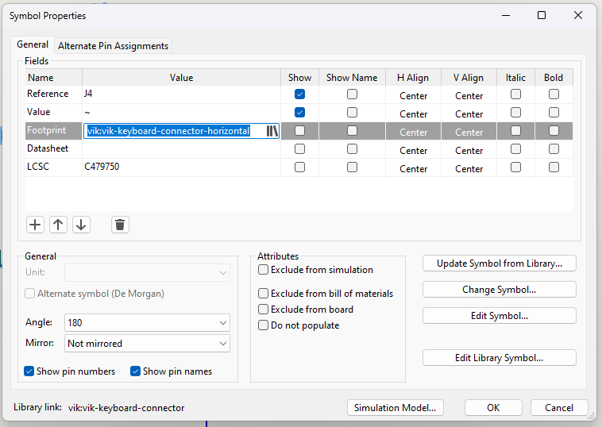

#### Example schematic for keyboard connector

#### Example wiring for keyboard connector

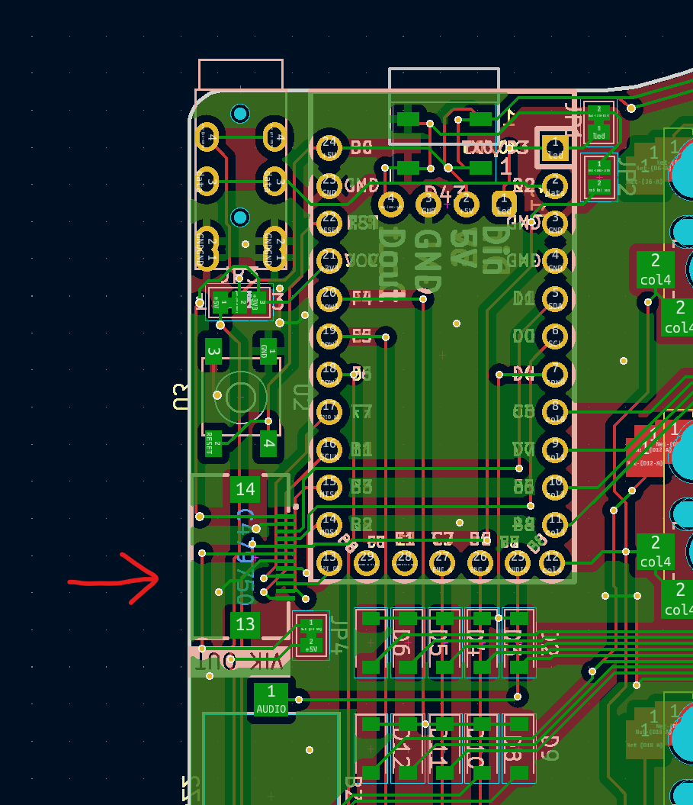

### Kicad module connector

1. Add a new symbol in the schematic, and select the `vik-module-connector`
2. Connect all the signals as specified
3. Associate with the type of footprint you'd like to use (all of the VIK examples use the horizontal connector footprint). Given you are making a module connector, be sure to use the ones that have the word module in them. See the image below for an example.
4. Update your PCB from the schematic and wire it up!

#### Adding the module connector symbol

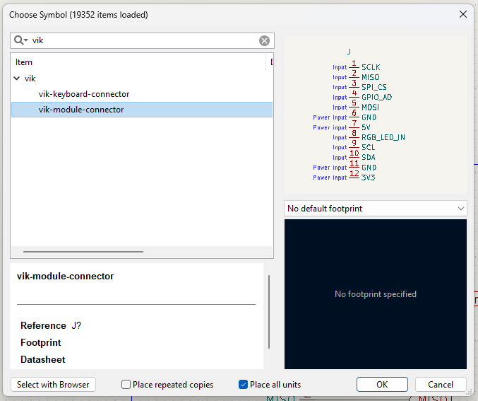

#### Assigning the module connector footprint

#### Example schematic for module connector

#### Example wiring for module connector

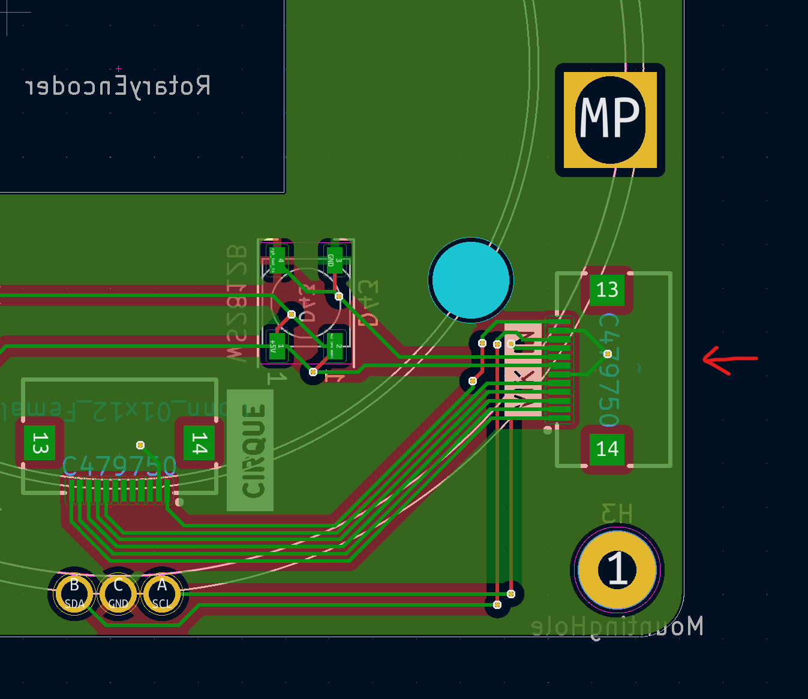

## Schematic design guide

Assuming you already have the VIK symbols and footprints included in your schematic, you will need to wire them according to the specs. Let's walk through each signal, and review how to wire. I'll break this into two parts, one for the keyboard design, and one for the module design.

### Keyboard schematic guide

First and foremost, it's very important that the keyboard have everything set up correctly. Given it's the one supplying the signals to the module, you want to be fully compatible with as many modules as possible.

Here is each signal, and an overview of how to wire it.

**3.3V**

This one is fairly straight forward in the sense that you just need to supply 3.3v. That said, there are controllers out there that do not include it natively. Please review the [Microcontroller selection](#Microcontroller-selection) section below for details.

**GND**

Connect ground to this pin.

**SDA**

Microcontrollers usually have more than one set of I2C signals. On dev boards like the [Helios](https://github.com/0xCB-dev/0xCB-Helios) or [Elite-Pi](https://docs.keeb.io/elite-pi-guide), it's as simple as wiring the SDA pin to the corresponding SDA pin on the VIK connector.

**SCL**

This is the exact same as described for SDA, but using SCL instead

**RGB Data Out**

If you don't have RGB leds on your keyboard, this can be any digital GPIO. Just pick any data signal, and route it to the RGB pin on the VIK connector.

If you are using RGB leds, you'll want to do two things:
1. Wire the data out from the last LED to the RGB pin on the VIK connector
2. Connect from the controller LED data pin to the VIK connector, but put an open jumper in the middle. The nice thing about this is that it allows the end user to still use the LED feature on a module without necessarily having the LEDs assembled on their keyboard.

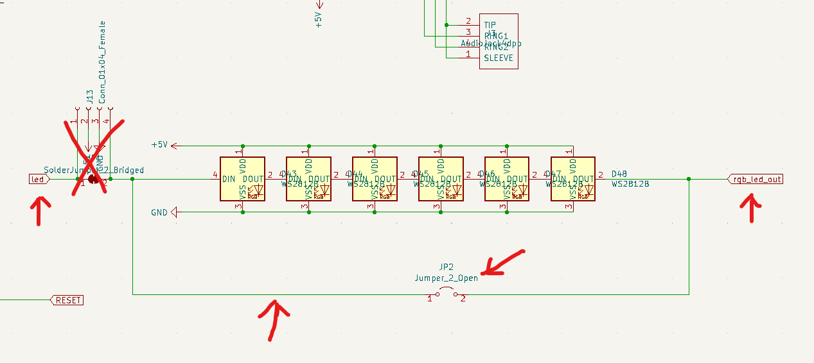

**5V**

Connect 5V to the VIK connector. Be careful not to use VCC on an RP2040 controller, as that is 3.3V. Instead, you can take the RAW output from a controller. On all controllers that I'm aware of as of this writing, it's the top right pin (please double check this before you wire it up).

For example, on the elite-pi:
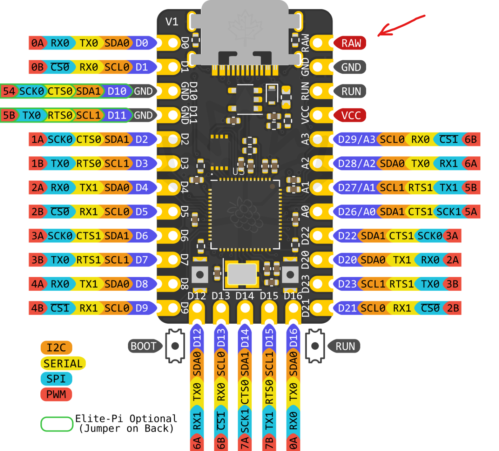

**Digital/Analog GPIO 1**

Similar to the RGB Data Out, you can select any pin, but it should support both digital and analog. Below is an example of the Elite-Pi, highlighting its pins that support both.

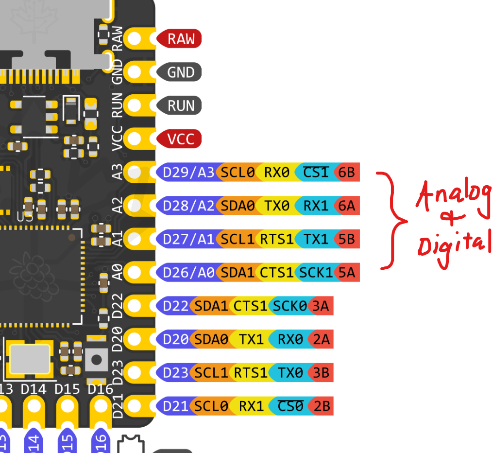

**MOSI**

Similar to I2C, SPI has predefined locations on most controllers. If doing an integrated controller, please refer to the datasheet to determine the correct pins.

That said, on dev controllers like the [Helios](https://github.com/0xCB-dev/0xCB-Helios) or [Elite-Pi](https://docs.keeb.io/elite-pi-guide), they are standard locations. See the image below. You can wire the 4 SPI pins as shown.

**Digital/Analog GPIO 2**

Same as `Digital/Analog GPIO 1`, but this should be a second independent GPIO of the same specifications.

**SPI CS**

No additional info beyond the `MOSI` section above. Same course of action, but for the SPI CS signal.

**MISO**

No additional info beyond the `MOSI` section above. Same course of action, but for the MISO signal.

**SCLK**

No additional info beyond the `MOSI` section above. Same course of action, but for the SCLK signal.

### Module schematic guide

There aren't any major considerations for the schematic for the module. Everything on the connector is an input, so you can choose what to do with them.

That said, please note that using the I2C or SPI pins for anything **other than I2C or SPI** will break on keyboards that use those signals on the main board. So, please avoid doing so if you care about maximizing compatibility.

## Design guidelines and recommendations

### Reference designs

For the keyboard side, I created a keyboard called [vulpes minora](http://github.com/sadekbaroudi/vulpes-minora). This keyboard has been manufactured and tested to work with VIK modules.

For the module side, please see the pcb directory in this repository. Each subdirectory within it has a module that you can review to see how these are implemented.

### I2C guidelines

#### Keyboard pcb

As mentioned above, the responsibility of using pull up resistors is on the VIK modules. This may cause challenges for a few reasons. You may want (or need) to use I2C on the main keyboard PCB, which means you need to use pull up resistors. If this is the case, please provide instructions to inform the users that when using VIK modules, they will need to remove (or not place) the pull up resistor on the keyboard.

#### Module pcb

When designing a module, please ensure that you include pull up resistors, since the guidelines state that the keyboard pcb is not responsible for it.

### Microcontroller selection

If you are designing a keyboard pcb that uses a dev board as a controller (e.g. pro micro, elite-c, stemcell, etc), you should consider that the VIK specs calls for 3.3V and 5V. Given these controllers operate on 5V and don't provide 3.3V, you won't be able to use them for VIK compatibility without additonal circuitry to convert 5V to 3.3V.

**As described at the top of the README in the note, the keyboard pcb should run at at 3.3v logic levels. The simplest option is to use a RP2040 based development board. For integrated controllers, either use a controller that already runs at 3.3v logic, or level shift the GPIO before going into the VIK connector.**

Some options include:
1. Support only RP2040 based controllers (e.g. splinky, elite-pi, helios), where VCC is 3.3V, and the RAW pin provides 5V
2. Support other 5V controllers, and use something like an LDO to convert 5V to 3.3V for the VIK 3.3V signal and GPIO signals
3. Anything you want, as long as you can provide 5V and 3.3V (both power and 3.3v gpio logic levels)

The vulpes minora is an example of point number 1 above.

## VIK certification

In order to be VIK certified, you should be compliant with everything above, and have your keyboard or module reviewed. Upon review, the reviewer will make a card for your pcb, as explained below.

### VIK keyboard certification card

#### Descriptions

* **FPC connector:** has the correct FPC connector with the right pinout, and is wired to specificaton. See the connectors in the kicad/vik.pretty directory
* **Breakout pins:** includes breakout pins using the [VIK breakout pin footprint](https://github.com/sadekbaroudi/vik/blob/master/kicad/vik.pretty/vik-keyboard-throughole.kicad_mod), or has through holes for all the signals. This allows easy access to all the signals. Also, the footprint is compatible with a [hand solderable FPC breakout board](https://www.amazon.com/uxcell-Converter-Couple-Extend-Adapter/dp/B07RVD1J1K).
* **Supplies: SPI** supplies SPI signals, including MISO, MOSI, SCLK, and CS
* **Supplies: I2C:** supplies I2C, including SDA and SCL
* **I2C on main PCB:** Does the main PCB use any I2C already. Valid responses are `yes` or `no`. If this is true, the `I2C pull ups` field must have a value
* **I2C pull ups:** I2C pull up resistor value, :x: if no pull ups on the main pcb, or resistor value if present
* **Supplies: RGB:** supplies RGB data out
* **Supplies: Extra GPIO 1:** supplies the extra GPIO, response will be one of: (**:x: | Digital Only | Analog/Digital**)
* **Supplies: Extra GPIO 2:** supplies the extra GPIO, response will be one of: (**:x: | Digital Only | Analog/Digital**)

#### Keyboard sample cards

Example of a failing card:

| Category                 | Classification          | Response           |
| -----------------------  | ----------------------- | ------------------ |
| FPC connector            | Required                | :heavy_check_mark: |
| Breakout pins            | Recommended             | :x:                |
| Supplies: SPI            | Required                | :heavy_check_mark: |
| Supplies: I2C            | Required                | :heavy_check_mark: |
| I2C on main PCB          | Discouraged             | yes                |
| I2C pull ups             | Informative             | 2.2kΩ              |
| Supplies: RGB            | Required                | :x:                |
| Supplies: Extra GPIO 1   | Required                | :x:                |
| Supplies: Extra GPIO 2   | Required                | :x:                |

A "perfect" keyboard card would look like this:

| Category                 | Classification          | Response           |
| -----------------------  | ----------------------- | ------------------ |
| FPC connector            | Required                | :heavy_check_mark: |
| Breakout pins            | Recommended             | :heavy_check_mark: |
| Supplies: SPI            | Strongly recommended    | :heavy_check_mark: |
| Supplies: I2C            | Strongly recommended    | :heavy_check_mark: |
| I2C on main PCB          | Discouraged             | no                 |
| I2C pull ups             | Informative             | N/A                |
| Supplies: RGB            | Strongly recommended    | :heavy_check_mark: |
| Supplies: Extra GPIO 1   | Required                | Analog/Digital     |
| Supplies: Extra GPIO 2   | Required                | Analog/Digital     |

### VIK module certification card

#### Descriptions

* **FPC connector:** has the correct FPC connector with the right pinout, and is wired to specificaton. See the connectors in the kicad/vik.pretty directory
* **Breakout pins:** includes breakout pins using the [VIK breakout pin footprint](https://github.com/sadekbaroudi/vik/blob/master/kicad/vik.pretty/vik-keyboard-throughole.kicad_mod), or has through holes for all the signals. This allows easy access to all the signals. Also, the footprint is compatible with a [hand solderable FPC breakout board](https://www.amazon.com/uxcell-Converter-Couple-Extend-Adapter/dp/B07RVD1J1K).
* **Uses: SPI:** the module is utilizing SPI
* **SPI used for SPI only:** if you are using any of the SPI gpio for any purpose other than SPI, this will remain unchecked. This means that keyboard pcbs that use SPI will be incompatible with this module.
* **Uses: I2C:**
* **I2C used for I2C only:** if you are using any of the I2C gpio for any purpose other than I2C, this will remain unchecked. This means that keyboard pcbs that use I2C will be incompatible with this module.
* **I2C pull ups:** I2C pull up resistor value, if applicable. These are only required if I2C is being used on the module.
* **Uses: RGB:** uses RGB data out
* **Uses: Extra GPIO 1:** uses the extra GPIO, response will be one of: (**:x: | Digital Only | Analog/Digital**)
* **Uses: Extra GPIO 2:** uses the extra GPIO, response will be one of: (**:x: | Digital Only | Analog/Digital**)
* **Standard PCB Size/Mount:** adheres to standard module size and mounts, responses will be one of: (**:x: | Small | Large**)

#### Module sample card

General example:

| Category                | Classification          | Response           |
| ----------------------- | ----------------------- | ------------------ |
| FPC connector           | Required                | :heavy_check_mark: |
| Breakout pins           | Recommended             | :x:                |
| Uses: SPI               | Optional                | :heavy_check_mark: |
| SPI used for SPI only   | Strongly recommended    | :heavy_check_mark: |
| Uses: I2C               | Optional                | :heavy_check_mark: |
| I2C used for I2C only   | Strongly Recommended    | :heavy_check_mark: |
| I2C pull ups            | Required                | 4.7kΩ              |
| Uses: RGB               | Optional                | :x:                |
| Uses: Extra GPIO 1      | Optional                | :x:                |
| Uses: Extra GPIO 2      | Optional                | :x:                |
| Standard PCB Size/Mount | Strongly recommended    | Large              |

## Known list of VIK certifications

### Keyboards

* [vulpes minora](http://github.com/sadekbaroudi/vulpes-minora)
* [stront](https://github.com/zzeneg/stront) - by zzeneg (partial support, see stront README for details)

### Modules

* [haptic](https://github.com/sadekbaroudi/vik/tree/master/pcb/haptic)
* [per56-cirque-leds](https://github.com/sadekbaroudi/vik/tree/master/pcb/per56-cirque-leds)
* [per56-pmw3360-leds](https://github.com/sadekbaroudi/vik/tree/master/pcb/per56-pmw3360-leds)
* [per56-pmw3360-cirque-leds](https://github.com/Ariamelon/Kiwano) - Kiwano by Ariamelon
* [pmw3360](https://github.com/sadekbaroudi/vik/tree/master/pcb/pmw3360)
* [ssd1351](https://github.com/Ariamelon/Crenshaw) - Crenshaw by Ariamelon